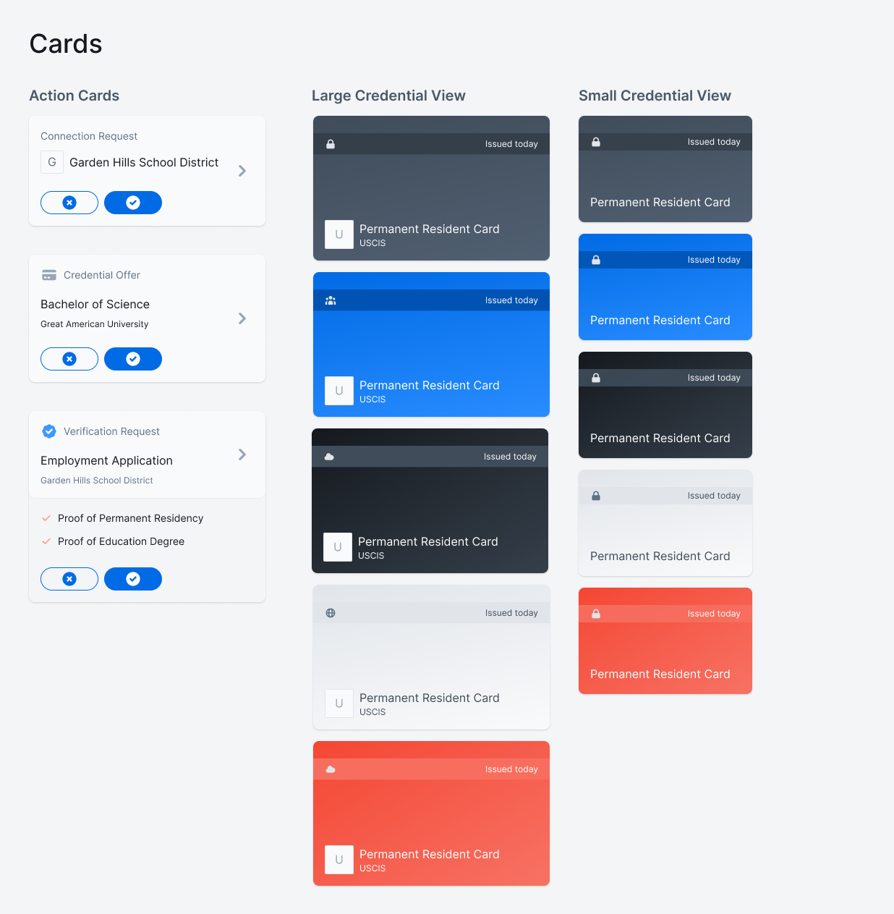

# Digital Wallet Implementation Guide
DHS Digital Wallet Challenge

##Video Walkthrough
https://youtu.be/p-JK2ZJ42tQ

## Product Overview

This wallet includes:

- a **wallet onboarding**
- a core **wallet screen** which contains
    - **action cards** notifying users of connection invitations, credential offers, and verification requests.
    - a space to store **credentials** in addition to sort and search features.
- a **connections** view displaying the names of connections that have been established with the wallet
- a **connection details view** which displays a log of all credential exchanges and conversations related to that specific connection
    - this view also enables the user to send **messages** and **credentials** to their **connections**.
- a user flow in which an individual can select specific **attributes** to share from a credential with a connection.
- a **wallet profile** screen which gives the user access to **settings** and view an **activity log** of all interactions that have been completed within the wallet.
- a scan code screen which enables an individual to scan a QR code and activate an action card within the wallet.
- a **credential details** view allowing an individual to view the specific attribute information related to a single credential.

## Documentation

To understand how the designs work under the hood, or to implement your own version of these designs using Trinsic’s APIs, visit [https://docs.trinsic.id/docs](https://docs.trinsic.id/docs)

## Full Prototype

### Instructions

To interact with the prototype illustrating how these flows work with one another:

1. Visit the following link: [https://www.figma.com/proto/EIf1p8MNGkJDDb0YStT680/DHS-Digital-Wallet-Submission?node-id=1%3A1131&viewport=1109%2C1138%2C0.336668461561203&scaling=min-zoom](https://www.figma.com/proto/EIf1p8MNGkJDDb0YStT680/DHS-Digital-Wallet-Submission?node-id=1%3A1131&viewport=1109%2C1138%2C0.336668461561203&scaling=min-zoom) 

If you get lost in the prototype, click anywhere on the screen, and blue “hint” indicators will show you what areas of the prototype are interactive. If you want to restart the prototype, press "R" on your keyboard.

2. Click through the onboarding process to see how that flow is intended to work, then begin the following tasks to see the rest of the app’s functionality in action 😎:

### Tasks

3. Click the Scan Code button to scan your first imaginary QR code and trigger the first action of the prototype: accepting two credentials.

4. Scan the QR code again to receive a third credential offer. This offer has details available to view within the prototype. You can add the credential to your wallet from either the details view, or the action screen depending on how much information you would like to sift through.

5. Scan the QR code a third time to accept a connection request.

6. Immediately after you accept that request, a presentation request will appear, asking you to share information from credentials existing within your wallet.

7. You can click into this presentation request to view details about which credentials are being used to satisfy the request requirements. This details view also offers information on how the organization plans to use the information they request. Additionally, since the second piece of information that is requested has two credentials in your wallet which satisfy the requirements, you can choose which one you want to send to Garden Hills.

8. Upon completing that request, feel free to explore the wallet prototype further:

9. Click into Connections to view your interactions with Garden Hills School District

10. Send them a message (by clicking into the prototype’s text box)

11. Click the card icon left of the text box to share the Master’s degree credential.

11. You can deselect the “Minor” attribute since it is not relevant to be sent over, then press Share.

12. Hold down your mouse and swipe down on the connections drawer to close it.

13. Click into the profile icon in the top right to view wallet details

14. You’ve explored the full prototype! Congratulations!

Feel free to email me (josh@trinsic.id) if you have any questions about this prototype at all.

## Information Architecture / User Flows

[DHS Wallet Implementation-2.pdf](assets/InformationArchitectureAndFlows.pdf)

To view the core Figma designs and see how all of the screens in our proposal are mapped out, create a Figma account and visit: [https://www.figma.com/file/EIf1p8MNGkJDDb0YStT680/DHS-Digital-Wallet-Submission?node-id=169%3A3075](https://www.figma.com/file/EIf1p8MNGkJDDb0YStT680/DHS-Digital-Wallet-Submission?node-id=169%3A3075) 

## Design Principles

### UX Research Summary

[Digital Wallet Case Study](https://www.notion.so/Digital-Wallet-Case-Study-56c8eea4a0044de2a785c10357bc81b2) 

### Iconography

All icons in these designs have been sourced from [https://heroicons.dev](https://heroicons.dev/) - an open-source project providing icons free for use.

### Typographic and Color Scales

The typography and colors in this project are optimized for compatibility with Tailwind CSS. You can learn more about this functional and flexible styling system here: [https://tailwindcss.com](https://tailwindcss.com/)  

```css
//styleName: 6xl - h1;
font-family: Inter;
font-size: 64px;
font-style: normal;
font-weight: 600;
line-height: 64px;
letter-spacing: -0.015em;

//styleName: 5xl - h2;
font-family: Inter;
font-size: 48px;
font-style: normal;
font-weight: 600;
line-height: 56px;
letter-spacing: -0.005em;

//styleName: 4xl - h3;
font-family: Inter;
font-size: 36px;
font-style: normal;
font-weight: 500;
line-height: 40px;
letter-spacing: 0em;

//styleName: 3xl - h4;
font-family: Inter;
font-size: 30px;
font-style: normal;
font-weight: 600;
line-height: 40px;
letter-spacing: 0.005em;

//styleName: 2xl - h5;
font-family: Inter;
font-size: 24px;
font-style: normal;
font-weight: 600;
line-height: 32px;
letter-spacing: 0em;

//styleName: xl - h6;
font-family: Inter;
font-size: 20px;
font-style: normal;
font-weight: 600;
line-height: 24px;
letter-spacing: 0px;

//styleName: large-subtitle1;
font-family: Inter;
font-size: 18px;
font-style: normal;
font-weight: 500;
line-height: 24px;
letter-spacing: 0.0015em;

//styleName: base-subtitle 2;
font-family: Inter;
font-size: 16px;
font-style: normal;
font-weight: 400;
line-height: 24px;
letter-spacing: 0.0015em;

//styleName: small-body1;
font-family: Inter;
font-size: 14px;
font-style: normal;
font-weight: 400;
line-height: 24px;
letter-spacing: 0.0015em;

//styleName: xs-body2;
font-family: Inter;
font-size: 12px;
font-style: normal;
font-weight: 400;
line-height: 16px;
letter-spacing: 0.0044em;

//styleName: micro;
font-family: Inter;
font-size: 10px;
font-style: normal;
font-weight: 400;
line-height: 16px;
letter-spacing: 0.0044em;

//styleName: xs small bold;
font-family: Inter;
font-size: 12px;
font-style: normal;
font-weight: 700;
line-height: 16px;
letter-spacing: 0.0044em;

//styleName: micro bold;
font-family: Inter;
font-size: 10px;
font-style: normal;
font-weight: 700;
line-height: 16px;
letter-spacing: 0.0044em;
text-align: left;
```

These designs are based on a 10pt color scale, with 10 variants existing for each color function.

```json
const trinsicPrimary = {
  50: "#C8EEF4",
  100: "#74D3E2",
  200: "#49C5D9",
  300: "#29B0C7",
  400: "#2396A9",
  500: "#1D7B8A",
  600: "#145661",
  700: "#10444C",
  800: "#0C3137",
  900: "#071E21",
};

const trinsicSecondary = {
  50: "#FAEBEE",
  100: "#EFC2CB",
  200: "#E599A8",
  300: "#DB7085",
  400: "#D8647A",
  500: "#CE3B57",
  600: "#B82E48",
  700: "#8F2438",
  800: "#661928",
  900: "#521420",
};

const trinsicAccent = {
  50: "#FFFBE6",
  100: "#FFF7CC",
  200: "#FFF2B3",
  300: "#FFE770",
  400: "#FFDF3D",
  500: "#FFDF3D",
  600: "#FFD60A",
  700: "#D6B300",
  800: "#A38800",
  900: "#705E00",
};
const trinsicGrey = {
  50: "#F9FAFB",
  100: "#F3F5F7",
  200: "#D2D8DF",
  300: "#B4BECA",
  400: "#97A5B5",
  500: "#5F7186",
  600: "#4A5868",
  700: "#404C59",
  800: "#353F4A",
  900: "#20262D",
};

const trinsicWarning = {
  50: "#FFF5F5",
  100: "#FFE6E6",
  200: "#FFB3B3",
  300: "#FF8080",
  400: "#FF4C4D",
  500: "#FF2424",
  600: "#E60000",
  700: "#B30000",
  800: "#800000",
  900: "#660000",
};

const trinsicblack = "#20262D";
```

## Component Examples




